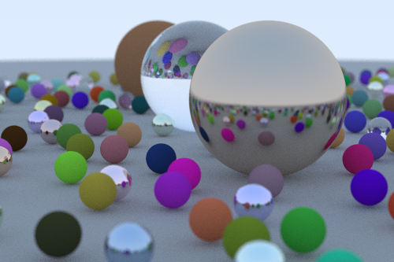

[Ray Tracing In One Weekend](https://raytracing.github.io/books/RayTracingInOneWeekend.html), but in Rust.

### Usage
```bash
cargo run --release > image.ppm
```
Which should produce something like this:


